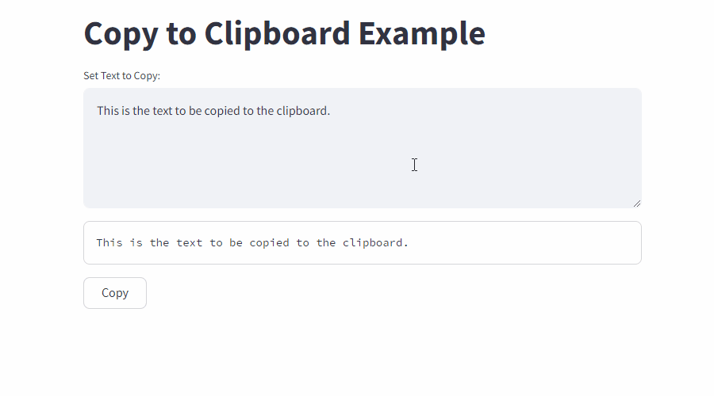

# Streamlit Copy to Clipboard

Demo website: https://copy-to-clipboard.streamlit.app



### To run locally

Create a virtual environment `.venv`:
```
python -m venv .venv
```

Start the virtual environment `.venv`:
```
.venv\Scripts\activate
```

Install requirements:
```
pip install -r requirements.txt
```

Start streamlit app:
```
streamlit run copy_to_clipboard.py
```